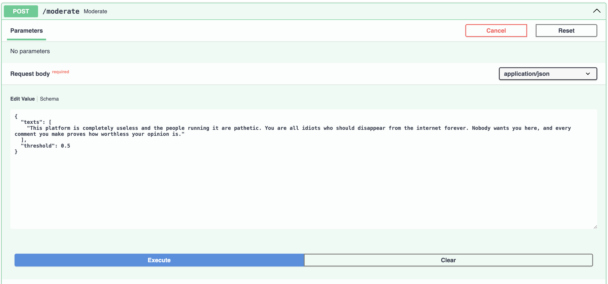
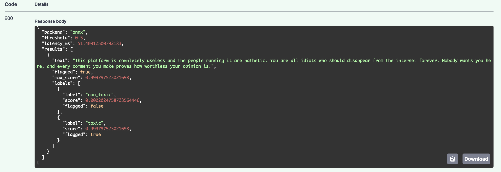
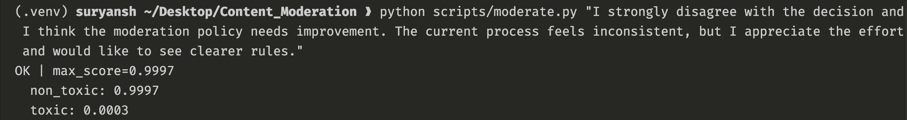
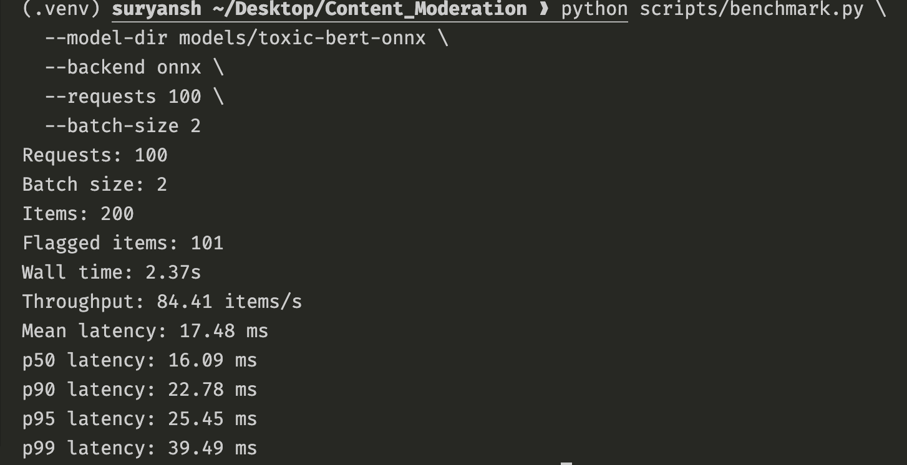

# Real-Time Content Moderation

FastAPI service for toxic comment detection using Transformer classifiers, with an ONNX Runtime path for lower-latency inference and a small benchmarking harness.

The default path is laptop-friendly: it uses a pretrained Hugging Face toxic-comment classifier, so you can demo inference, deployment, ONNX export, and latency benchmarking without training a model locally.

## What It Includes

- Configurable model backbone: DistilBERT, RoBERTa, or DeBERTa sequence classifiers.
- Fine-tuning script for toxic-comment style datasets from Hugging Face Datasets.
- ONNX export and graph optimization with Optimum + ONNX Runtime.
- FastAPI inference endpoint with batched predictions and thresholding.
- Latency benchmarking for local model calls or a running API server.

## Demo

### Swagger API Request



### Swagger API Response



### CLI Moderation



### ONNX Benchmark



## Setup

```bash
python -m venv .venv
source .venv/bin/activate
pip install -e ".[dev]"
```

## Laptop-Friendly Demo

Run the API directly with a pretrained toxic-comment classifier:

```bash
uvicorn moderation_api.main:app --app-dir src --host 0.0.0.0 --port 8000
```

Example request:

```bash
curl -X POST http://localhost:8000/moderate \
  -H "content-type: application/json" \
  -d '{"texts":["You are wonderful","I hate you and hope you disappear"],"threshold":0.5}'
```

Quick terminal helper:

```bash
python scripts/moderate.py "You are wonderful" --url http://localhost:8000/moderate
python scripts/moderate.py "I hate you and hope you disappear" --url http://localhost:8000/moderate
```

Benchmark the pretrained model locally:

```bash
python scripts/benchmark.py --requests 100 --batch-size 4
```

## Model Options

Default pretrained model:

```bash
CONTENT_MODERATION_MODEL_DIR=JungleLee/bert-toxic-comment-classification
```

You can still train your own DistilBERT, RoBERTa, or DeBERTa model later:

```bash
distilbert-base-uncased
roberta-base
microsoft/deberta-v3-base
```

## Optional Tiny Fine-Tune

Full `civil_comments` training is too heavy for most laptops. The training script now defaults to a streamed 2,000-row sample so it can be used as a portfolio demo without processing the full dataset.

```bash
python scripts/train.py \
  --model-name distilbert-base-uncased \
  --dataset-name civil_comments \
  --output-dir models/smoke-toxic \
  --epochs 1 \
  --max-samples 2000 \
  --batch-size 8
```

For serious training, run this on Colab, Kaggle, or a cloud GPU and increase `--max-samples` or disable it.

## Export And Optimize ONNX

Model artifacts are not committed to GitHub because the exported ONNX files are large. Recreate them locally with the command below.

Export the pretrained classifier directly:

```bash
python scripts/export_onnx.py \
  --model-dir JungleLee/bert-toxic-comment-classification \
  --output-dir models/toxic-bert-onnx \
  --optimization-level O2
```

Or export your own fine-tuned model:

```bash
python scripts/export_onnx.py \
  --model-dir models/smoke-toxic \
  --output-dir models/smoke-toxic-onnx \
  --optimization-level O2
```

Use `O3` for AVX2 CPU targets, or `O4` for GPU mixed precision.

## Run API

PyTorch mode:

```bash
CONTENT_MODERATION_MODEL_DIR=JungleLee/bert-toxic-comment-classification \
uvicorn moderation_api.main:app --app-dir src --host 0.0.0.0 --port 8000
```

ONNX mode:

```bash
CONTENT_MODERATION_MODEL_DIR=models/toxic-bert-onnx \
CONTENT_MODERATION_BACKEND=onnx \
uvicorn moderation_api.main:app --app-dir src --host 0.0.0.0 --port 8000
```

## Benchmark

Benchmark the local model:

```bash
python scripts/benchmark.py \
  --model-dir models/toxic-bert-onnx \
  --backend onnx \
  --requests 200 \
  --batch-size 8
```

Benchmark the API endpoint:

```bash
python scripts/benchmark.py \
  --api-url http://localhost:8000/moderate \
  --requests 200 \
  --batch-size 8
```

The report includes mean, p50, p90, p95, p99 latency, throughput, and toxicity decision counts.
